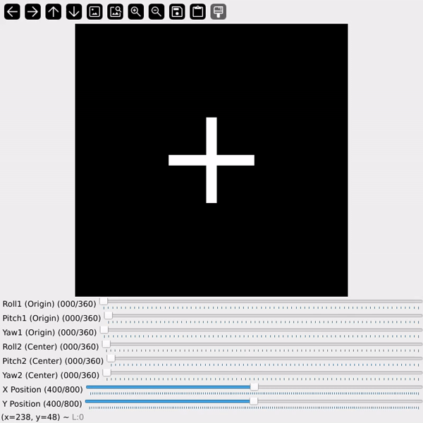
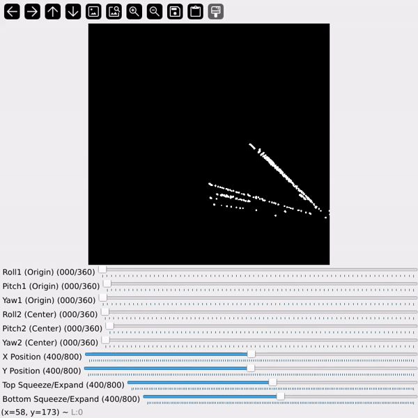

# **Roll, Pitch, Yaw Visualization with OpenCV**



```bash
## demo using plus sign
test_plus.py
```
#
#


```bash
## demp on poly pts
test_plus.py
```

## **Overview**
This repository demonstrates how to visualize **Roll**, **Pitch**, and **Yaw** **(both origin and center)** rotations using a simple **3D axis representation in 2d space and its actuall limitaions** in OpenCV. These rotations correspond to the orientation of an object in 3D space:

